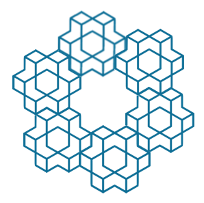

# agymc

**For reinforcement learning and concurrency lovers out there ...**

### TL;DR

- Mostly the same API as gym, except now multiple environments are run.
- Envs are run concurrently, which means speedup with time consuming operations such as backprop, render etc..

### Intro

This is a concurrent wrapper for OpenAI Gym library that runs multiple environments concurrently, which means running faster in training\* without consuming more CPU power.

### What exactly is _concurrency_ ?

Maybe you have heard of _parallel computing_ ? When we say we execute things in parallel, we run the program on _multiple_ processors, which offers significant speedup. _Concurrency computing_ has a broader meaning, though. The definition of a _concurrent_ program, is that it is designed not to execute sequentially, and will one day be executed parallelly\*\*. A _concurrent program_ can run on a sigle processor or multiple processors. These tasks may communicate with each other, but have separate private states hidden from others.

### Why do we need _concurrency_ on a single processor ?

Some tasks, by nature, takes a lot of time to complete. Downloading a file, for example. Without concurrency, the processor would have to wait for the task to complete before starting to execute the next task. However, with concurrency we could temporarily suspend the current task, and come back later when the task finishes. **Without using extra computing power.**

### So much for introducing concurrency... now, what is gym ?

OpenAI gym, is a `Python` library that helps research reinforcement learning. Reinforcement learning is a branch from control theory, and focusing mainly on agents interacting with environments. And OpenAI gym provides numerous environments for people to benchmark their beloved reinforcement learning algorithms. For you agents to *train* in a _gym_, they say.

### Um, so why do we need agymc, do you say ?

Despite its merits, OpenAI gym has one major drawback. It is designed to run _one agent on a processor at a time, only_. What if you want to run multiple environments on the same processor at a time? Well, it will run, **sequentially**. Which means slow if you want to train a robot in _batches_.

### Experiments

Using `env.render` as our bottlenecking operation, runing 200 environments, our version`agymc` completes 50 episodes in 4 minutes, while naive `gym` version takes around twice as long. This is what the madness looks like:

### Wow, how to use agymc ?

`agymc`, which combines the power of `Python` async API and OpenAI gym, hence the name, uses the exact same API as OpenAI gym. Except now the returns are in _batches_ (lists). And except serveral environments are run asynchronously.

\* When doing pure `gym` operation such as sampling, stepping, this library runs slower since this is a wrapper for gym. However, for actions that _takes a while to execute, such as backprop and update, sending data back and forth, or even rendering_, concurrency makes the operations execute much faster than a [naive gym implementation](./test/ref.py)

\*\* If you would like to learn more about concurrency patterns, [this](https://www.youtube.com/watch?v=rDRa23k70CU) video is really informative.